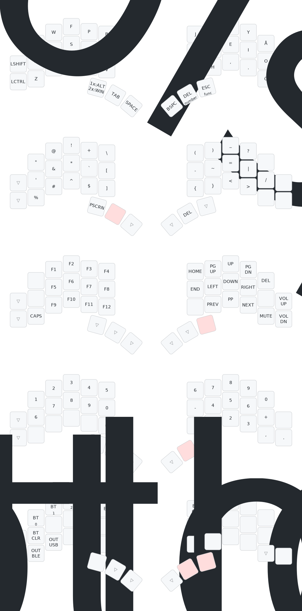

# Brain Layout

Created with <a href="https://github.com/caksoylar/keymap-drawer">keymap-drawer</a>

# Keymap Drawer

## ZMK Physical Keyboard Layout Converter Permalink

https://zmk-physical-layout-converter.streamlit.app/?layout=H4sIAAAAAAACA5WSwY6CMBRF935Fwxpfel9bgVn7F8aFC2dlMgmjyRDCv09VUop2cjMr4PVyWs5l3BhTXU7D1-36XX2YMT7Gwf78ebpdrmmQMnFymCfGjKb6iQOIrU01xDsrXTBT_RrQLOC0EHBZwBbWfbauXSEQsoAv7QBLE2CbQMkx4diHwjNXyzlVUCKkdTDZYLJBZIPJBpUNKhtUNphsUNl_uEIgtpcPcaQNZW0oa0NJG8raUNqG0jaUtqGsDaVtKG2jbNuLS-shxNt-eat_urgH-uGRDaFoq4Bw9j-InbjmneFXjB1htKI6M7y07czY5pBWPIF0EhIjnWPrVoyGMOLP0SSITQfJpb5BZsbxcb0_TZvpF8w0-IJHBgAA

## How to Handle Swedish Symbols

https://github.com/caksoylar/keymap-drawer/discussions/166#discussioncomment-12691543

<!--
# Sweep layout

# Brain layout

# Symbol mnemonic/reminders

# TODO:
- [] Finish layout for brain
- [] Mnemonics in markdown instead of the picture
- [] Caps word [more info](https://getreuer.info/posts/keyboards/caps-word/index.html)
- [] Caps number [more info](https://github.com/zmkfirmware/zmk/pull/1451) -->
